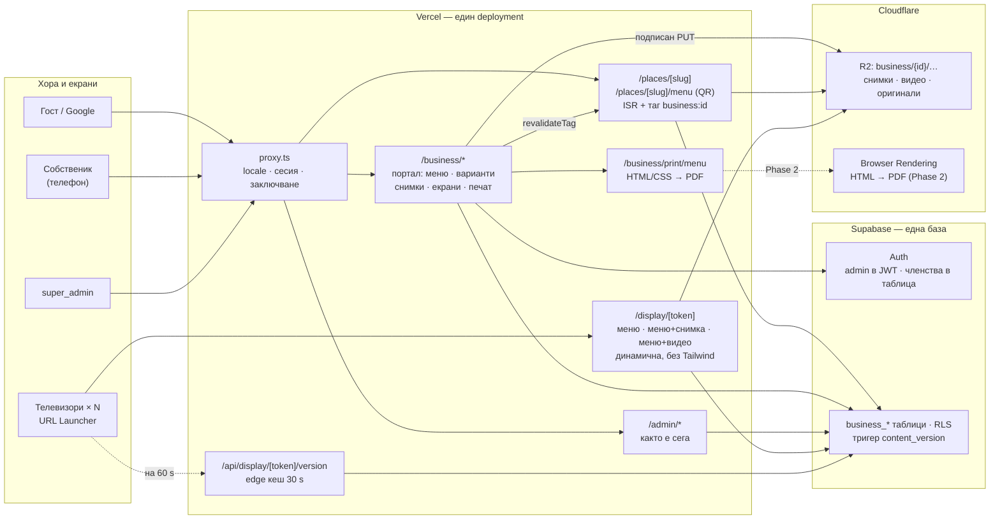

# Bansko NOW Business Platform — архитектурен анализ

**Дата:** 16 септември 2026 · **Версия 2** — след решенията на собственика и втория преглед · **Обхват:** repo `kanelov/bansko.now` (main @ `1103559`), живата Supabase база `rzjyawjdhcedddydmfge`, Vercel проектът `bansko-now` · Планът, по който платформата се строи; напредъкът е в блока „Изпълнение“ по-долу. Всичко в анализа е прочетено от реалните файлове и от живата база — където има число, то е измерено, не предположено.


> **Изпълнение (обновява се на всяка стъпка)**
>
> | Стъпка | Статус | Дата | Бележки |
> |---|---|---|---|
> | 0 · Миграционен поток и документация | готово | 2026-09-16 | `supabase/migrations/`, CLAUDE.md §28, този файл |
> | 1 · Tenant схема, права, категории като данни | готово | 2026-09-16 | 3 миграции; тестов бизнес „Old Town Coffee“ активиран |
> | 2 · Скелет на портала `/business` | предстои | | |
> | 3 · Модул меню (категории, артикули, варианти, медия) | предстои | | |
> | 4 · QR меню, `/places`, часове | предстои | | |
> | 5 · Екрани `/display/<token>` | предстои | | |
> | 6 · Печат | предстои | | |
> | 7 · Втвърдяване и помощ в портала | предстои | | |
> | 8 · Пилот | предстои | | истинското кафе се въвежда преди пилота |
>
> **Решения на собственика след v2 (16.09.2026):** видеата за екраните качва админът; шрифтове Playfair Display + Inter; телевизорът показва двуезичен ред; часовете влизат в MVP; телевизорите на кафето още не са избрани (помощта покрива и URL Launcher, и stick); тестов бизнес сега, истинското кафе преди пилота; миграциите отиват направо в живата база, стъпка по стъпка в `main`.

---

## Резюме на една страница

**Идеята е правилна и съществуващата основа я позволява.** Един Next.js проект, един Supabase, един Vercel deployment, изолация по `business_id`, отделен портал `/business` и едно меню, което се показва на четири места — всичко това се вписва в начина, по който Bansko NOW вече е построен. **Но днешният „бизнес“ е каталожна визитка, не tenant:** в 103-те RLS политики няма нито едно `auth.uid()`, единствената роля е `admin` в JWT, собственикът е ред с имейл в `business_contacts` без връзка към потребител, в базата има 1 потребител. Tenant моделът се строи от нулата — върху здрава основа (RLS на всичките 40 таблици, `requireAdmin()` навсякъде, чист модел за преводи, готово presigned качване към R2).

**Решения, които вече са взети и влизат в плана:**

1. **Валута — само EUR.** `price_cents` е в евроцентове; няма колона за валута и няма двойно обозначаване в данните. Ако към старта някой закон още иска и лева, това е флаг в *показването* с фиксирания курс, не в схемата.
2. **Само собственик в MVP.** `business_members` пази ролята (`owner` / `staff`) от първия ден, но порталът създава само собственици. Служители по-късно = включване на вече написаните политики и една страница, без миграция. Записано е в стъпка 0 като бъдеща възможност.
3. **Vercel планът не се решава сега.** Остава един ред в таблицата с рисковете, за да не се забрави при първия платен клиент.
4. **Снимки и видео — на Cloudflare R2**, с механизма, който фотоархивът вече ползва: браузърът качва направо в R2 с подписан адрес (`createUploadUrl` в `photo-storage.ts`), сървърът после прави размерите. Това не е избор по вкус — Vercel реже всяко тяло на заявка над **4,5 MB**, така че снимка от телефон през server action просто не минава.
5. **Ролите на бизнес потребителите — в таблица, не в JWT.** С прости думи: JWT е като пропуск, който се печата при вход и важи до час след като бъде отнет; таблицата се проверява при всяко действие и достъпът спира веднага. При приоритет „максимална сигурност“ това е единственият правилен избор. Отгоре: „пазач на колони“ — собственикът никога не може да пипне `status`, `listing_tier`, `paid_until` и другите полета, които са на админа (раздел 7).
6. **Категориите на бизнесите — данни, не код.** Днес десетте категории са масив от низове в `src/lib/businesses.ts` — нова категория значи програмист и деплой. Като таблица с преводи и икона се добавят от админа, а всеки бизнес сочи към ред.
7. **Модулите — таблица `business_modules`** (приемам втория преглед вместо `enabled_modules text[]`): по един ред на бизнес и модул, с `enabled` и малки настройки на модула.
8. **Варианти на артикул (малко / голямо) — в MVP** (приемам втория преглед). С едно правило за цената и с преводи на имената на вариантите, които прегледът пропуска.
9. **Оперативните полета — в `business_platform_settings`**, не в `businesses` (приемам). `businesses` получава само `category_id`, `phone`, `email_public`.
10. **Телевизорите** — три готови шаблона (само меню; меню + снимка; меню + видео), без редактор на менюто и без визуален конструктор; видео = собствен MP4 от R2, не YouTube; проверка на версията на 60 s; без интернет остава последното меню.
11. **Печат** — дизайнът се прави веднъж в HTML/CSS (фон-снимка, вградени шрифтове с кирилица, векторни икони); файлът е PDF от същата страница. Раздел 12 обяснява как това дава еднакъв резултат при всеки.
12. **Документацията е част от всяка стъпка:** `CLAUDE.md` (нов раздел „Business Platform“), `CHANGELOG.md`, помощ за собственика в самия портал (по образеца на `/admin/guide`) и този документ в `docs/`. Нищо не е „готово“, докато четирите не са опреснени.

**Къде не следвам втория преглед буквално:**

- `business_modules.settings jsonb` — да, но само за настройки на модул с валидирани ключове (zod). Не става място за оформление на екрани — това е задната врата към page builder.
- „Преглед 16:9 преди запазване“ — да, но като **същата** страница `/display/<token>` в `<iframe>`, не втори рендер. Прегледът трябва да е истината, не приближение.
- Часовете и „Отворено/Затворено“ излизат от MVP, както предлага — но са първото нещо след пилота (един ден) и схемата им е готова тук, за да не се измисля пак.
- `business_platform_settings` — приемам, и добавям каквото прегледът пропуска: `platform_status` и `plan` също отиват там, а таблицата има нужда от същия пазач на колони като `businesses`, защото в нея пише и собственикът (само `open_override`).
- Вариантите — приемам с две подробности: артикул с варианти няма собствена цена (иначе има две истини), и имената на вариантите са с BG/EN преводи като всичко друго.

**Какво е ново във v2 спрямо v1**

| v1 | v2 |
|---|---|
| `enabled_modules text[]` върху `businesses` | таблица `business_modules` |
| `open_override`, `menu_version`, `default_currency`, `platform_status`, `plan` върху `businesses` | `business_platform_settings` (1:1); валутата отпада |
| „Капучино малко“ и „Капучино голямо“ като два реда | `business_menu_item_variants` (+ преводи) в MVP |
| `business_displays.layout jsonb` | явни колони: `template`, `theme`, `media_id` + `business_display_categories` |
| `business_media` само снимки | `media_type` image/video, оригиналът се пази за печат |
| `business_promotions` с три булеви „покажи на…“ | Phase 2, с `business_promotion_channels` (може да сочи конкретен телевизор) |
| качване „през server action → sharp“ | подписан PUT от браузъра към R2 (както фотоархива), после sharp — заради лимита 4,5 MB |
| `/display` като ISR + ревалидиране | динамична страница без кеш (зарежда се само при промяна) + версия през edge кеша |
| `@react-pdf/renderer` за истински PDF | същата HTML/CSS страница → PDF през Chromium (в браузъра сега; Cloudflare Browser Rendering по-късно) |
| служители в MVP | само собственик; служители — готова схема, изключена |
| 9 стъпки, ~18–22 дни | 8 стъпки, ~19–24 дни (вариантите и екраните с видео добавят, служителите и часовете махат) |

**Реалистичен MVP за първото кафе:** Tenant/RLS → вход → меню с категории и варианти → цени / SOLD OUT → QR меню → 2 телевизора → меню за печат. Около 19–24 работни дни.

---

## 1. Как работи Bansko NOW сега (в частите, които имат значение)

### Стек и деплой

| Компонент | Реално състояние |
|---|---|
| Framework | Next.js **16.1.6** (App Router, Turbopack), React 19.2.4, TypeScript, Tailwind **4.3.1**, pnpm |
| Vercel | проект `bansko-now`, Node 24, план Hobby, домейни `bansko.now`, `www.bansko.now`; **лимит 4,5 MB на тяло на заявка към функция** (платформен, не се заобикаля с настройка — `serverActions.bodySizeLimit: "90mb"` в `next.config.ts` не важи на Vercel) |
| Supabase | проект „Bansko.now“, eu-central-1, Postgres 17.6, организация „ART GALLERY“ на план Free; в същата организация е и приложението за заявки |
| Размер | база **15 MB** (от 500 MB), storage **5,4 MB** в 13 файла, 40 таблици, 103 RLS политики, **1 потребител** |
| Middleware | `src/proxy.ts` (в Next 16 middleware се казва proxy): пренаписва `/` към `/bg`, опреснява сесията само за `/admin`, държи заключването „Очаквайте скоро“; matcher-ът пропуска `_next/static`, `_next/image` и файлове с разширение на картинка — **не и `.woff2`** |
| Икони | Font Awesome (`@fortawesome/free-solid-svg-icons`) — SVG, векторни |
| Шрифтове | системни: `Inter, Segoe UI, system-ui` и `Georgia` — **нищо не е вградено**; на телевизор или в PDF, генериран на Linux, тези шрифтове ги няма |

### Маршрути

- `src/app/(site)/[locale]/…` — публичният сайт; български без представка, английски под `/en`.
- `src/app/admin/…` — админът със **собствен root layout**, `requireAdmin()` в защитения layout, `AdminShell` с 14 секции, `/admin/guide` — ръководство за собственика с `GuideSummary` („Накратко“) и `GuideDetails` („Подробно“).
- `src/app/api/…` — време, търсене, фотоархив, Stripe webhooks (проверка на подпис), мостът към приложението за заявки (`Bearer` таен ключ, `timingSafeEqual`), Content Hub.
- `src/app/coming-soon/` — поканата.

### Данни и клиенти към Supabase

| Клиент | Файл | Ключ | Кога |
|---|---|---|---|
| server | `src/lib/supabase/server.ts` | anon + бисквитки на сесията | админ страници и действия — **RLS важи** |
| public | `src/lib/supabase/public.ts` | anon, без сесия, един споделен екземпляр | публични четения — страниците могат да са статични |
| admin | `src/lib/supabase/admin.ts` | **service role**, `server-only` | 12 места: поръчки Art Studio, фотолицензи, Stripe, синхронизация — заобикаля RLS |

### Auth и права

- Supabase Auth, имейл и парола, **няма публична регистрация**.
- Админ = `app_metadata.role = 'admin'`; SQL функцията `public.is_admin()` чете същото от JWT.
- Всяко админ действие започва с `await requireAdmin()`.
- Валидацията е ръчна (`stringValue`, `uuidValue`, регулярни изрази). Няма zod. **Няма rate limiting никъде.**
- Security съветникът: защитата от изтекли пароли е **изключена**; `automation_import_keys` има RLS без политики и я няма в repo-то (дрифт).

### Днешният модел на бизнесите

`supabase/business-directory.sql` описва каталог, не платформа:

- **`businesses`** — име, `category` (свободен текст), описание, адрес, `latitude/longitude`, видео, сайт/Instagram/Facebook, `images text[]`, `faqs jsonb`, `features text[]`, `status` (draft/approved/rejected), `listing_tier` (free/premium/homepage), `requested_plan_id`/`active_plan_id`, `payment_status`, `paid_until`, „На фокус“, `priority`, `map_pin_x/y`, SEO полета, бележки на админа.
- **`business_translations`** — по един ред на език; уникален ключ `(business_id, locale)`.
- **`business_contacts`** — име, имейл, телефон на собственика. **Не сочи към `auth.users`.**
- **`business_listing_plans`** — три годишни нива с цена в лева и Stripe Payment Link; плащането се маркира на ръка.
- Живо: 5 демо бизнеса, 5 превода, 5 контакта; bucket `business-images` е празен и **позволява анонимно качване** с anon ключа.

Няма работно време, меню, варианти, екрани, медия на бизнеса — нищо от платформата.

### Публичните страници и картата

`/businesses`, `/businesses/[slug]` (hero, галерия, видео, удобства, FAQ, JSON-LD `LocalBusiness` + `FAQPage`), `/businesses/map` (илюстрирана карта с пинове в проценти, без Leaflet), `/businesses/submit` (анонимна чернова + имейл). Четат през public клиента; статични с ревалидиране при промяна от админа (`revalidatePublicPath`, `revalidateLocalePath`); `revalidate = 900` на началната, статиите, Art Studio и фотоархива. Снимките на бизнесите се показват с `` от Supabase Storage.

### Преводи

Два езика. Интерфейсът — `dictionaries` в `src/lib/i18n.ts`. Съдържанието — в таблици `*_translations`, по ред на език, приложено последователно на седем места. Нов език = нови редове.

### Снимки и файлове

- Supabase Storage: `bansko-media` (публично четене, админ пише), `business-images` (публично четене, **анонимно качване**), `art-studio-orders` (частен).
- `sharp` прави три WebP размера 480/960/1600 (`src/lib/image-variants.ts`).
- Фотоархивът е на **Cloudflare R2** (`src/lib/photo-storage.ts`): публични и частни префикси, `createUploadUrl()` — **подписан PUT, с който браузърът качва мастера направо в R2** (`photo-uploader.tsx`: „Large files never pass through the Vercel function“), `uploadPhoto()` за сървърните варианти с `Cache-Control: public, max-age=31536000, immutable`, подписани GET линкове за частните файлове. CORS на bucket-а вече е настроен за браузърен PUT — иначе фотоархивът нямаше да работи.

### Кеш, Realtime, PDF, документация

- ISR 15 минути + ревалидиране по път. Няма `unstable_cache`, няма кеш тагове.
- **Realtime не се ползва никъде.** Analytics няма. PDF няма. Имейл: Resend. Плащания: Stripe.
- `CLAUDE.md` вече изисква: запис в `CHANGELOG.md` след всяка промяна, опресняване на `/admin/guide` и на самия `CLAUDE.md` при промяна на процес („три места, всяка промяна“), малки идемпотентни миграции с `if not exists`, RLS включен, публичните политики да излагат само одобрени полета, service role само в сървърен код. Платформата наследява тези правила и добавя четвърто място — помощта в портала.

### Какво няма в repo-то

Няма миграционна история — SQL файловете в `supabase/` се прилагат на ръка. Живата база вече се разминава с repo-то (`automation_import_keys`). За платформа с двадесет нови таблици това се оправя в стъпка 0.

---

## 2. Какво от съществуващото се преизползва

| Съществуващо | Как влиза в платформата |
|---|---|
| Supabase Auth + `is_admin()` | Остава за `super_admin`. Собствениците влизат през **същия** Auth |
| Навикът `requireAdmin()` | Става `requireBusinessOwner(businessId)` в началото на всяко действие в портала |
| Три клиента към Supabase | Порталът — server клиентът с бисквитки (RLS важи); QR менюто, телевизорите и печатът — public клиентът; service role **не влиза** в портала |
| `businesses` + `business_translations` + плановете | Профил и каталожна видимост на tenant-а; не се пренаписват |
| `*_translations` моделът | Категории на менюто, артикули, варианти, промоции |
| `/businesses/[slug]` и JSON-LD | Основа на публичния профил; добавя се менюто |
| Илюстрираната карта | Остава както е |
| `revalidatePublicPath` / `revalidateLocalePath` | Обобщават се с кеш тагове по бизнес |
| `createImageVariants` (sharp) | Същият код, източникът е файл от R2 вместо от формата |
| `photo-storage.ts` — `createUploadUrl`, `uploadPhoto`, публичен базов адрес | **Готовият път за качване на снимки и видео на бизнеса** — нищо ново в инфраструктурата |
| `photo-uploader.tsx` | Образецът за качващия компонент в портала (подписан PUT → „готово“ → сървърът прави размерите) |
| Font Awesome SVG | Икони на QR менюто, телевизора и печата — векторни, еднакви навсякъде |
| `/admin/guide` (`GuideSummary`/`GuideDetails`) | Същият компонент за помощта в портала |
| Resend | Покана на собственик, известия |
| Stripe Payment Links | Достатъчни за „премиум“ и в първата година |
| `proxy.ts` | Сесия на `/business`, изключения от заключването, по-късно домейни |
| `SiteHeader`/`SiteFooter` | Само в „Bansko NOW“ представянето; QR менюто ги ползва в лека форма, телевизорът и печатът — не |

---

## 3. Какво трябва да се добави

**Tenant и права:** `business_members`, `business_platform_settings`, `business_modules`, две SQL помощни функции, пазач на колони, RLS на всяка нова таблица, затваряне на анонимното качване.

**Категории на бизнесите като данни:** `business_categories` + преводи; `businesses.category_id`.

**Меню:** `business_menu_categories`, `business_menu_items`, `business_menu_item_variants` — всяка с преводи; един loader `getBusinessMenu()` за всичките представяния.

**Медия:** `business_media` — снимки (три размера + оригинал) и видео (MP4), на R2 под `business/<id>/…`.

**Екрани:** `business_displays` с шаблон/тема/медия, `business_display_categories`; `/display/<token>`; `/api/display/<token>/version`; `content_version` тригер.

**Печат:** `/business/print/menu` с `@page` размери, вградени шрифтове, оригиналите на снимките.

**Портал:** route group `src/app/business/` със собствен root layout: вход, пазач, табло, меню, екрани, печат, профил, помощ.

**Инфраструктура:** миграции през Supabase CLI, zod за формите, rate limit на входа, self-hosted шрифтове с кирилица (`next/font/local`), R2 префикс, кеш тагове, CSS без Tailwind за `/display` (раздел 11).

**След пилота:** `business_hours`, `business_hour_exceptions`, `open_override`, `business_promotions` + канали, профил v2, `business_menu_item_options` (добавки), аналитика, домейни.

---

## 4. Архитектурна диаграма



**Един източник на истина, четири представяния.** Менюто живее само в `business_menu_*`. Профилът, QR менюто, телевизорите и печатът извикват **един и същ loader** и само го рисуват различно. Порталът пише; всичко друго чете. Телевизорът никога не говори със Supabase — само с Vercel (страница + 40-байтов отговор за версията) и с R2 (медия).

---

## 5. Предложена схема на базата

Принципи: всяка tenant таблица има `business_id uuid not null references businesses(id) on delete cascade` и индекс по него; текстовете са в `*_translations`; цените са `integer` евроцентове; `updated_at` с тригера `set_updated_at()`, който вече съществува; `sort_order integer` навсякъде, където човекът подрежда; всичко идемпотентно, в `supabase/migrations/`.

### Върху съществуващата `businesses` — само профил

| Колона | Тип | Защо |
|---|---|---|
| `category_id` | `uuid → business_categories` | заменя свободния текст; старото `category` остава до преноса |
| `phone`, `email_public` | `text` | днес телефонът е само в контакта на собственика |

Нищо оперативно, нищо от платформата. `businesses` остава каталогът, който админът управлява.

### Платформа и права

| Таблица | Полета | Бележки |
|---|---|---|
| `business_platform_settings` | `business_id` pk/fk, `platform_status` check (`listing`, `active`, `suspended`) default `listing`, `plan text` default `free`, `open_override` check (`auto`, `open`, `closed`) default `auto`, `content_version integer` default 1, `updated_at` | 1:1 с бизнеса; редът се създава от админа при активиране. Админът пише `platform_status`/`plan`; собственикът — само `open_override`; тригерът — `content_version` |
| `business_modules` | `business_id`, `module text` check (`menu`, `displays`, `print`, `hours`, `promotions`, `analytics`, `custom_domain` …), `enabled bool`, `settings jsonb` default `{}`, `updated_at`; pk `(business_id, module)` | Включва/изключва **админът** (модулите са част от плана); собственикът пипа само `settings` на включен модул, с валидирани ключове. Бъдещи модули (`rooms`, `rentals`, `activities`) са нов ред, не нова колона |
| `business_categories` | `id, slug unique, icon_name, sort_order, is_active` + `business_category_translations(category_id, locale, name)` unique `(category_id, locale)` | Иконата е име на Font Awesome икона |
| `business_members` | `id, business_id, user_id → auth.users, role` check (`owner`, `staff`), `invited_email, invited_by, invited_at, accepted_at, created_at`; unique `(business_id, user_id)`; индекс `user_id` | MVP създава само `owner`. Служителите са готови в схемата и в политиките, изключени в портала |

### Медия

| Таблица | Полета | Индекси |
|---|---|---|
| `business_media` | `id, business_id, media_type` check (`image`, `video`), `kind` check (`cover`, `gallery`, `item`, `display`, `print_background`, `logo`), `original_key` (R2), `variant_keys jsonb` (`{"480":…,"960":…,"1600":…}` само за image), `mime_type, bytes, width, height, duration_seconds` (видео), `alt, sort_order, created_at` | `(business_id, kind, sort_order)` |

Оригиналът се пази винаги — печатът на A3 иска 3 500+ px, а WebP размерите са за екран.

### Меню

| Таблица | Полета | Индекси |
|---|---|---|
| `business_menu_categories` | `id, business_id, sort_order, is_active` + `_translations(category_id, locale, name, description)` | `(business_id, sort_order)`; unique `(category_id, locale)` |
| `business_menu_items` | `id, business_id, category_id → business_menu_categories, price_cents integer null` check `>= 0`, `availability` check (`available`, `sold_out`), `is_active` (скрит/видим), `sort_order, media_id → business_media null, tags text[], allergens text[]` + `_translations(item_id, locale, name, description)` | `(business_id, category_id, sort_order)`; unique `(item_id, locale)` |
| `business_menu_item_variants` | `id, item_id → business_menu_items, business_id, price_cents integer not null` check `>= 0`, `is_active, sort_order` + `_translations(variant_id, locale, name)` | `(item_id, sort_order)`; unique `(variant_id, locale)` |

**Правилото за цената (единствената истина):** артикул **без** варианти има `price_cents`; артикул **с** варианти има `price_cents = null` и цените са по вариантите. Никога и двете. Loader-ът го смята, а един малък тригер го пази в базата (при добавяне на първи вариант нулира `price_cents`; при изтриване на последния изисква цена). SOLD OUT е на артикула; вариант се скрива с `is_active = false`. Добавките (овесено мляко, двойно еспресо) са Phase 2 — `business_menu_item_options` — и не пипат тези таблици.

### Екрани

| Таблица | Полета | Индекси |
|---|---|---|
| `business_displays` | `id, business_id, name` („Ляв телевизор“), `token text unique` (32 случайни знака), `template` check (`menu_only`, `menu_image`, `menu_video`), `theme` check (`dark`, `light`) default `dark`, `media_id → business_media null` (снимката или видеото за шаблоните 2 и 3), `show_descriptions bool` default false, `is_active, last_seen_at, updated_at` | `token` |
| `business_display_categories` | `display_id → business_displays, category_id → business_menu_categories, sort_order`; pk `(display_id, category_id)`; и двата FK `on delete cascade` | изтрита категория изчезва и от екрана сама |

Никакъв `layout jsonb`. Всичко, което екранът може да е, се описва с четири колони и един списък с категории. Ако някога трябва „плейлист“ от няколко изгледа, това е нова таблица `business_display_slides` — не промяна тук.

### След пилота (само за да не блокираме себе си)

- `business_hours(business_id, weekday 0–6, opens, closes, is_closed)` unique `(business_id, weekday, opens)`; `business_hour_exceptions(business_id, date, opens, closes, is_closed, note)`.
- `business_promotions(id, business_id, price_cents null, media_id, starts_at, ends_at, is_active, sort_order)` + `_translations(title, description)` и **`business_promotion_channels(promotion_id, channel` check (`profile`, `menu`, `display`)`, display_id null)`** — „веднъж създадена, показана на избрани места“, включително на конкретен телевизор. Промоция, насочена към екран, замества медията в неговия слот.
- `business_menu_item_options(item_id, …)` — добавки с надценка.
- `business_events_daily(business_id, day, event_type, count)` — аналитика без тежка таблица.
- `business_domains(business_id, hostname unique, kind, verified_at, is_primary)`.
- `business_social_posts(...)` — раздел 18.

### Тригерът за версията

`private.bump_content_version()` — `after insert/update/delete` на `business_menu_categories`, `business_menu_items`, `business_menu_item_variants`, всичките им `_translations`, `business_displays`, `business_display_categories`, `business_media` и на `open_override` в `business_platform_settings`: `update business_platform_settings set content_version = content_version + 1 where business_id = <ред>`. Един брояч на бизнес — при промяна всичките му телевизори презареждат. С два телевизора това е точното поведение; прескочени числа са без значение.

### Tenant модел

Всичко се държи за `business_id`. Няма отделна схема, няма отделна база — при 100 бизнеса това са ~25 000 реда. Изолацията е в RLS (раздел 7), не в структурата.

---

## 6. Auth и роли

| Роля | Къде | Защо там |
|---|---|---|
| `super_admin` | JWT `app_metadata` (както сега) | Един човек, глобална; `is_admin()` вече работи |
| `owner` | ред в `business_members` | може да е собственик на два бизнеса; отнема се веднага |
| `staff` | ред в `business_members` — **изключен в MVP** | същото, с по-малко права; включва се без миграция |

**Вход:** същият Supabase Auth, отделна страница `/business/login` със собствен вид. Регистрация няма. Админът от `/admin` натиска „Активирай платформата“ за бизнес: създава ред в `business_platform_settings`, включва модулите по плана и кани собственика по имейл (Supabase `inviteUserByEmail`); поканата създава ред в `business_members` с `invited_email`, който се свързва с `user_id` при първия вход.

**Проверка в кода (защита в дълбочина):** `requireBusinessOwner(businessId)` в началото на всяко server action и в layout-а на портала — чете `business_members` за `auth.uid()`. Дори кодът да пропусне проверка, RLS спира записа.

**Служители по-късно:** политиките за `staff` се пишат сега (наличност и SOLD OUT през RPC `set_item_availability`, нищо друго), но порталът няма страница за покани и не показва ролята. Включването е една страница „Служители“ и един ред в `CLAUDE.md`. Това е записано като бъдеща възможност, както поиска.

**Кой е „текущият бизнес“:** бисквитка `bn_business`; при един бизнес се избира автоматично; при два — избор. Всяка заявка проверява, че този `business_id` е сред членствата — бисквитката е удобство, не доказателство.

**Двоен фактор за админа:** Supabase поддържа TOTP; при приоритет „сигурност на целия сайт“ включването му за `super_admin` е половин час работа и влиза в стъпка 7.

---

## 7. RLS и security дизайн

### Помощни функции

```sql
create or replace function public.member_business_ids()
returns setof uuid language sql stable security definer set search_path = public as $$
  select business_id from public.business_members
  where user_id = auth.uid() and accepted_at is not null
$$;

create or replace function public.business_role(p_business_id uuid)
returns text language sql stable security definer set search_path = public as $$
  select role from public.business_members
  where user_id = auth.uid() and business_id = p_business_id and accepted_at is not null
$$;

-- Кои бизнеси са публично видими за даден модул: одобрен каталог + активна платформа + включен модул
create or replace function public.public_business_ids(p_module text)
returns setof uuid language sql stable security definer set search_path = public as $$
  select b.id
  from public.businesses b
  join public.business_platform_settings s on s.business_id = b.id and s.platform_status = 'active'
  join public.business_modules m on m.business_id = b.id and m.module = p_module and m.enabled
  where b.status = 'approved'
$$;
```

### Шаблон на политиките за всяка tenant таблица

- **Публично четене:** `for select to anon, authenticated using (is_active and business_id in (select public.public_business_ids('menu')))`. Изключен модул или спряна платформа = невидими данни, без да се трие нищо. Подзаявката не зависи от реда, затова Postgres я изпълнява веднъж на заявка.
- **Собственик:** `for all to authenticated using (business_id in (select public.member_business_ids()) and (select public.business_role(business_id)) = 'owner') with check (същото)`.
- **Служител (написана, без ефект докато няма редове `staff`):** само `select`; записите му минават през RPC.
- **Админ:** `using ((select public.is_admin()))`.
- Една политика на действие с `or` вътре — performance съветникът вече брои 10 таблици с припокриващи се permissive политики; новите не добавят към списъка.

### Пазач на колони (новото спрямо v1)

Собственикът трябва да редактира профила си в `businesses` (описание, телефон, снимки), но **никога** `status`, `listing_tier`, `requested_plan_id`, `active_plan_id`, `payment_status`, `paid_until`, `priority`, `is_featured`, SEO бележките на админа. RLS не различава колони, затова:

```sql
create or replace function private.guard_business_columns()
returns trigger language plpgsql as $$
begin
  if (select public.is_admin()) then return new; end if;
  if new.status is distinct from old.status
     or new.listing_tier is distinct from old.listing_tier
     or new.paid_until is distinct from old.paid_until
     -- … останалите админски колони
  then raise exception 'column reserved for admin' using errcode = '42501';
  end if;
  return new;
end $$;
```

Същият пазач върху `business_platform_settings` (собственикът пипа само `open_override`) и върху `business_modules` (само `settings`). Това е разликата между „собственикът може да редактира профила си“ и „собственикът може да си одобри премиум“.

### Storage

R2 не знае за Supabase Auth, така че правата са в кода: подписан PUT адрес се издава само от server action, който е минал `requireBusinessOwner`, за ключ `business/<business_id>/<kind>/<uuid>.<ext>`, с ограничение по `Content-Type` и размер; редът в `business_media` се създава чак след като сървърът е потвърдил обекта (HEAD) и е направил размерите. Bucket-ът `business-images` в Supabase губи политиката „Public can upload validated business images“ при първата миграция.

### Service role

Извън портала. Порталът работи с бисквитки, RLS е стената. Service role остава за server-to-server (Stripe, мостът към приложението за заявки, покани).

### Threat model на модула

| Заплаха | Защита |
|---|---|
| Собственик на A праща заявка за `business_id` на B | RLS `with check`; `requireBusinessOwner` спира по-рано |
| Собственик си вдига `listing_tier` или удължава `paid_until` | пазачът на колони; RLS сама не стига |
| Изтекъл собственик | изтриване на реда в `business_members` — важи от следващата заявка |
| Налучкване на пароли на `/business/login` | rate limit (Vercel WAF правило или таблица с опити), включване на leaked password protection, TOTP за админа |
| Злонамерен файл | подписан адрес само за `image/jpeg,png,webp` (≤ 8 MB) и `video/mp4` (≤ 150 MB); снимките се пресъздават от `sharp` (това неутрализира почти всичко); видеото се проверява по MIME и размер и се сервира от R2, никога изпълнено на сървъра; име = UUID |
| Enumerация на екрани `/display/…` | токен от 32 знака, не slug; неактивен = 404 |
| XSS през име на артикул на телевизора / в PDF | React екранира; без `dangerouslySetInnerHTML`; HTML-ът за PDF се генерира от същите React компоненти |
| Портал в `<iframe>` от чужд сайт | `X-Frame-Options: SAMEORIGIN` вече е глобален; прегледът на екрана е същият произход |
| CSRF | server actions са защитени по произход; формите не приемат GET |
| Изтичане между tenant-и през кеш | таговете носят `business_id`; порталът е `no-store` |
| Админ функции през портала | порталът никога не импортира `admin/actions`; админът вижда бизнесите през админа |

---

## 8. Business Portal — маршрути и компоненти

```
src/app/business/
  layout.tsx              ← собствен <html><body>, шрифтове през next/font/local
  login/page.tsx
  select/page.tsx         ← само при >1 бизнес
  (portal)/
    layout.tsx            ← requireBusinessOwner(); BusinessShell (долна лента за телефон)
    page.tsx              ← табло: име, брой артикули, SOLD OUT с едно докосване, екрани online/offline
    menu/page.tsx         ← категории и артикули; влачене за ред; SOLD OUT; скрит/видим
    menu/[itemId]/page.tsx← артикул: BG/EN, цена ИЛИ варианти, снимка, алергени
    displays/page.tsx     ← списък екрани; всеки с шаблон, категории, медия, преглед 16:9, адрес + QR
    print/page.tsx        ← A4 / A3 / за маса · BG / EN / двуезично · фон · „Свали PDF“
    media/page.tsx        ← библиотека: снимки и видео, качване, изтриване
    profile/page.tsx      ← описание, телефон, снимки на профила (полетата, които собственикът може)
    guide/page.tsx        ← помощ: „Накратко / Подробно“ по образеца на /admin/guide
  actions.ts              ← всички server actions; първи ред: requireBusinessOwner
src/app/display/[token]/page.tsx        ← телевизорът; собствен layout, без Tailwind
src/app/api/display/[token]/version/route.ts
src/app/business/print/menu/page.tsx    ← страницата за печат (без shell)
src/lib/business-platform/{members,menu,media,displays,print,settings}.ts
```

Принципи: **всичко е server components**, клиентски JavaScript само там, където има докосване — превключвател SOLD OUT, влачене, качване. Мобилен първо: долна лента с 5 елемента, големи бутони, без таблици. **Без** `AdminShell` и без `--admin-*` променливи — порталът има свой светъл, спокоен вид с цветовете на Bansko NOW (paper, forest, sage, clay). Езикът на портала е български.

`getBusinessMenu(businessId, { locale, categoryIds?, includeHidden? })` в `menu.ts` връща една нормализирана структура (категории → артикули → варианти, с изчислена цена/„от“, SOLD OUT, снимка). Профилът, QR менюто, `/display` и печатът я ползват без изключение — това е „единственото меню“ в код.

В `proxy.ts`: `/business` влиза при опресняването на сесията (днес само `/admin`); `/business`, `/display` и `/api/display` се изключват от locale пренаписването и от заключването „Очаквайте скоро“ (телевизорът и QR менюто на кафето трябва да работят и докато сайтът е затворен); `.woff2` се добавя към изключенията на matcher-а, ако шрифтовете не са през `next/font`.

---

## 9. Публичен профил на бизнеса

**URL:** `/places/<slug>` (и `/en/places/<slug>`). Сайтът е заключен и има 5 демо реда — преименуването от `/businesses` е безплатно **днес** и скъпо след старта. Сменя се сега, с 308 redirect в `next.config.ts`.

**MVP:** днешната страница + секция „Меню“ (откъс: първите категории с цени, „Виж цялото меню“ → QR страницата) + JSON-LD `hasMenu` → `Menu` / `MenuSection` / `MenuItem` с `offers.price` в EUR — точно каквото Google очаква за заведения.

**След пилота (профил v2):** „Отворено до 18:00“ (изчислено на сървъра в Europe/Sofia), промоции, часове, бутони Упътване / Обади се / Instagram, „Виж още в Банско“.

**Basic срещу Premium** се решава от `platform_status` + `business_modules`: визитка = `listing`; платформа = `active` + модули. Същата страница, различни секции. Няма два шаблона.

---

## 10. QR меню

**URL:** `/places/<slug>/menu` и `/en/places/<slug>/menu`. Статична страница (ISR + ревалидиране по таг при запис), **нула клиентски JavaScript**: категориите са котви, артикулите — списък, вариантите — „Малко 2,90 · Голямо 3,90“ или „от 2,90 €“, SOLD OUT — зачертано с етикет, скритите артикули ги няма. Цел: < 30 KB HTML, да се отваря за секунда на слаб мобилен интернет в заведението.

QR кодът се генерира на сървъра като SVG (библиотека `qrcode`) в портала, с `?src=qr` за бъдещата аналитика; порталът дава и лист за печат с QR и логото.

Индексира се, с `canonical` към себе си и `hreflang`.

---

## 11. Телевизори

### Принципът

Телевизорът е **автоматично представяне** на централното меню, не второ меню. Секцията „Екрани“ в портала не редактира нито един артикул — тя само казва: *кои категории + кой шаблон + коя снимка или видео → на кой телевизор*. Промяна в „Меню“ (цена, SOLD OUT, скрит артикул, име) стига до всеки екран сама, за под минута, без някой да копира нещо.

### Какво избира собственикът за всеки екран

| Настройка | Колона | Пример „TV 1 — Ляв“ | Пример „TV 2 — Десен“ |
|---|---|---|---|
| Име | `name` | Ляв телевизор | Десен телевизор |
| Активен | `is_active` | да | да |
| Шаблон | `template` | `menu_image` | `menu_video` |
| Категории (и ред) | `business_display_categories` | Кафе, Топли напитки | Кроасани, Сандвичи |
| Медия | `media_id` | `croissant-promo.webp` | `fresh-croissants.mp4` |
| Тема | `theme` | тъмна | тъмна |
| Описания | `show_descriptions` | не | не |

И двата екрана рисуват едни и същи артикули и цени от `getBusinessMenu()`.

### Трите шаблона (MVP)

1. **Само меню** — целият екран е менюто.
2. **Меню + снимка** — 70 % меню, 30 % снимка (пропорцията е част от шаблона, не настройка).
3. **Меню + видео** — 70 % меню, 30 % видео в цикъл, без звук.

Шаблоните са три React компонента с обикновен CSS. Четвърти шаблон = четвърти компонент, не конструктор. Ако някога трябва „няколко изгледа, които се сменят“ — това е `business_display_slides` (Phase 2), пак от готови шаблони.

### Автоматично оформление — правилата, които заместват редактора

- Размерите на шрифта са във `vh` (`clamp()` върху височината на екрана), не в пиксели: Full HD и 4K изглеждат еднакво, защото 4K телевизорът така или иначе докладва 1920 × 1080 CSS пиксела при двойна плътност.
- Колоните се смятат от броя редове: до ~22 реда — една колона, до ~44 — две, иначе три. Категорията никога не се къса между колони.
- Ако всички артикули в категория имат едни и същи варианти (Малко / Голямо), вариантите стават колони с цени и заглавен ред; иначе цените са в реда. Това е разликата между „списък“ и „меню, което изглежда проектирано“.
- SOLD OUT: зачертано + етикет, остава на място (гостът вижда, че го има по принцип).
- Не се събира ли: страницата го знае (мери overflow) и го казва на прегледа в портала — „Не се събира на екрана: махни категория или скрий описанията“. Собственикът решава, не алгоритъм. Автоматичното превъртане на страници е Phase 2, ако някой клиент има 80 артикула.

### Технически ограничения на телевизорите, които определят как се пише страницата

Браузърът на Samsung Tizen е **заключен на версията от годината на модела**: Tizen 6.5 (модели 2022) = Chromium 85, Tizen 7.0 (2023) = Chromium 94. Не се обновява. Следствия:

- **`/display` не ползва Tailwind 4.** Tailwind 4 разчита на `@property`, `color-mix()` и `@layer`, които изискват Chrome 111+ — на телевизора стилът просто няма да се приложи. Страницата има собствен, обикновен CSS (grid, flex, `clamp()`, `vh`), без `aspect-ratio`, `inset`, `:has()`, container queries, `svh`.
- **Скриптът е малък и „стар“:** проверка на версията, презареждане, нощен reload — вграден, без модерен синтаксис, без bundle.
- **Шрифтове** — вградени WOFF2 с кирилица (`@font-face`); на телевизора няма Inter, нито Georgia.
- **Видео** — `<video autoplay muted loop playsinline>` с **MP4 H.264 + AAC**; WebM/VP9 не е гарантиран на всеки модел. 1080p, ≤ 60 s, ≤ ~40 MB; файлът се тегли веднъж и остава в кеша на браузъра (`Cache-Control: immutable`, което `uploadPhoto` вече слага).
- **Памет** — Tizen тече по памет при седмици отворена страница: пълно презареждане веднъж на нощ (в 04:00, само ако проверката на версията е минала) и `meta refresh` на 6 часа като застраховка.

### Универсално ли е решението?

Страницата — да, за всеки браузър. Моделно-специфично е само **дали телевизорът може сам да отвори адреса при включване**:

| Устройство | Как | Допълнителен хардуер |
|---|---|---|
| Samsung Smart Signage (QB/QM/OM серии) и Business TV **BE** серия | вграден **URL Launcher** (при Tizen 7: „Custom App“): въвежда се адресът, включва се „Auto start“, изключват се скрийнсейвърът и автоматичното изключване; при спиране на тока се връща сам | няма |
| LG webOS Signage | същото през „SI Server / URL Loader“ | няма |
| Обикновен телевизор (Samsung/LG/друг) | браузърът съществува, но не стартира сам и не помни адреса надеждно | Android TV stick (~40 €) + Fully Kiosk Browser, или Raspberry Pi в kiosk режим — превръща всеки HDMI екран в такъв |

Практическо правило: **преди покупка** се проверява дали конкретният модел има „URL Launcher“ в менюто. Кафето купува телевизора; ние даваме адреса и една страница „Как се настройва“ в помощта на портала.

### Как стигат промените (без Realtime)

1. Порталът записва (напр. Chocolate Croissant → SOLD OUT) → тригерът вдига `content_version` на бизнеса.
2. Телевизорът на всеки **60 s** пита `/api/display/<token>/version` — ~40 байта `{"v":"17-1726480000"}` (`content_version` + `updated_at` на самия екран, за да се хване и смяна на шаблона). Отговорът е с `Cache-Control: s-maxage=30, stale-while-revalidate=60`; базата се пита най-много веднъж на 30 s за всички телевизори на света.
3. Различна версия от вградената в страницата → `location.reload()`.

Резултат: под минута до екрана; **нула отворени връзки към базата**; телевизорът никога не вижда Supabase. Самата `/display/<token>` е **динамична, без кеш** — зарежда се само при промяна (десетина пъти на ден), така че ISR и ревалидиране тук са излишна сложност, а с тях можеше да презареди в стара версия.

**Без интернет:** презареждане има само след успешна проверка на версията — затова прекъснат интернет никога не сменя менюто с грешка на браузъра. Последното меню остава на екрана; след 3 неуспешни проверки в ъгъла се появява малка точка „офлайн“. Service Worker за истинска офлайн застраховка е Phase 2, ако пилотът покаже нужда.

### Преглед 16:9 в портала

Страницата „Екрани“ показва **същия** `/display/<token>?preview=1` в `<iframe>`, мащабиран от 1920 × 1080 към ширината на картата с `transform: scale()`. `preview=1` спира проверката на версията и презареждането. Каквото е в прегледа — това е на телевизора, защото е една и съща страница; страницата съобщава и „не се събира“ през `postMessage`.

### Проверка на схемата от v1 спрямо този подход

| v1 | Позволява ли го? | Минимална промяна |
|---|---|---|
| `business_displays.layout jsonb` | технически да, но е зародиш на page builder | заменено с `template`, `theme`, `media_id`, `show_descriptions` + `business_display_categories` |
| `business_media` само снимки | не | `media_type` (`image`/`video`), `duration_seconds`, оригиналът се пази |
| `business_promotions` с три булеви `show_on_*` | не позволява „на TV 1, но не на TV 2“ | Phase 2: `business_promotion_channels(channel, display_id)`; промоция към екран замества медията в слота |
| `menu_version` на `businesses` | да, но пише в грешната таблица | `content_version` в `business_platform_settings`, тригер и върху екраните и медията |
| ISR за `/display` | работи, но може да презареди в стара версия | динамична страница; версията през edge кеш остава |
| R2 модел | да | нов префикс `business/<id>/{image,video,original}/`; `createUploadUrl` за MP4 с лимит и MIME |

Нищо от това не прави TV модула конструктор: собственикът избира от списъци, всичко останало е шаблон.

---

## 12. Печат / PDF

### Отговор на въпроса „как ще стане красиво“

Точно както го описваш: **фон-снимка, върху която HTML/CSS подрежда менюто**, и от това — файл. Няма втори дизайн, няма втори инструмент. Изискванията, които изброи, се решават така:

| Изискване | Решение |
|---|---|
| Фон като снимка | `business_media` с `kind = print_background`; за печат се ползва **оригиналът** (A4 при 300 dpi = 2 480 px, A3 = 3 508 px по дългата страна — WebP 1600 не стига). `print-color-adjust: exact`, за да не изчезне фонът при печат |
| Стандартни шрифтове, еднакви навсякъде | шрифтовете са **вградени** в страницата (`@font-face`, WOFF2 с кирилица, `next/font/local`) — не системни. Chromium ги влага в PDF-а, печатницата вижда същото. Днешните `Georgia`/`Inter` са системни и на Linux ги няма — затова се избират два шрифта с кирилица (раздел 24) |
| Никакви разкривени икони | само инлайн SVG (Font Awesome вече е в проекта) — вектор, еднакъв на всяка резолюция. **Без емоджи**: те са различни шрифтове на всяка система и на Linux често са празни квадратчета |
| Точен размер | `@page { size: A4 }` / `A3` / за маса (DL 99 × 210 mm или A5), `margin: 0`, дизайнът с 3 mm bleed за печатница или с бяло поле за офис принтер — избор в портала |
| BG / EN / двуезично | същият loader, три подредби на колоните |
| Цените винаги верни | страницата чете `business_menu_*` в момента на генериране |

### Как се получава файлът

| Вариант | Кога | Как |
|---|---|---|
| **Печат от браузъра → „Запази като PDF“** (MVP) | от първия ден, нула инфраструктура | бутонът „Свали PDF“ отваря страницата за печат и диалога; `margin: 0` премахва колонтитулите на Chrome, `print-color-adjust: exact` включва фона независимо от отметката „Background graphics“. На компютър резултатът е идентичен с Chromium-а на сървъра, защото е същият двигател |
| **Cloudflare Browser Rendering** (Phase 2) | „Поръчай печат“ (студиото получава файл), сваляне от телефон с едно докосване | REST `/pdf` — приема готов HTML (генериран от същите React компоненти) и връща PDF; файлът се записва в R2. Същият акаунт като R2. Безплатният план: **10 минути браузър на ден, 6 заявки в минута** — десетки менюта дневно. Един ден работа, когато потрябва |
| `@react-pdf/renderer` | не | втори език за оформление без CSS — дизайнът се прави два пъти и по-бедно |
| Chromium вътре във Vercel функция | не | ~50 MB, 3–8 s студен старт, на ръба на паметта — когато Cloudflare дава същия браузър като услуга |

Разликата спрямо v1: махам `@react-pdf/renderer`. Твоето изискване е „красиво като сайта“, а най-силният инструмент за това е HTML/CSS, който вече имаме.

---

## 13. Собствен поддомейн и домейн

**Възможно е в същия deployment.** `proxy.ts` чете `host`; ако не е `bansko.now`/`www`, търси го в `business_domains` и пренаписва към скрит route group `/_tenant/<slug>/…` — „мини-сайт“ представяне без хедъра на Bansko NOW. Едни данни, три представяния:

| | `bansko.now/places/cafe` | `cafe.bansko.now` | `cafe.bg` |
|---|---|---|---|
| Навигация | Bansko NOW | само на кафето | само на кафето |
| DNS | — | `*.bansko.now` CNAME към Vercel (wildcard в проекта) | клиентът сочи към Vercel; домейнът се добавя в проекта |
| SSL | — | автоматичен | автоматичен |
| Фаза | MVP | Phase 2 | Phase 3 |

Подводни камъни, които се решават в кода, не после: `metadataBase`/canonical по host, отделни `robots`/`sitemap` по host, host-aware locale логика в proxy-то, заключването „Очаквайте скоро“ да знае за домейните. Домейнът на клиента е негов (регистрация, подновяване) — платформата само го сочи.

---

## 14. BG/EN преводи

**Запазваме модела `*_translations`** — за категории, артикули, **варианти** и по-късно промоции. Причини: целият сайт е така и помощните функции работят по него; трети език = редове, не `ALTER TABLE`; частично преведено меню е нормално състояние.

Правила: липсва ли EN → показва се BG (не празно). Порталът показва BG и EN полета едно до друго; собственикът може да остави EN празно. Етикетите („Разпродадено“, „от“) са в `dictionaries`. `name_bg`/`name_en` колони — не.

Телевизорът показва един език (настройка на екрана в Phase 2; MVP — български, или двуезично „Капучино / Cappuccino“ в един ред — избор в раздел 24). Печатът има трите варианта.

---

## 15. Снимки, видео и storage

**Всичко на Cloudflare R2, от първия ден,** под `business/<business_id>/{original,image,video}/<uuid>…`, през механизма на фотоархива:

1. Порталът иска подписан PUT адрес (server action след `requireBusinessOwner`, с `Content-Type` и максимален размер за ключа).
2. Браузърът качва **направо в R2** (`photo-uploader.tsx` е образецът) — нищо не минава през Vercel, лимитът 4,5 MB не важи.
3. „Готово“ → server action проверява обекта (HEAD, размер, MIME), за снимки тегли оригинала и прави 480/960/1600 WebP с `sharp` (`createImageVariants` с параметър за източник), записва ред в `business_media`.
4. Видеото не се обработва — качва се готов MP4 (H.264/AAC, 1080p, ≤ 150 MB); порталът показва изискванията и проверява MIME; ако ти правиш видеата на клиентите (вероятно — това е и твоят занаят), ги качваш ти от админа.

Показване: `` от готовите размери, **не** `next/image` (Hobby има 5 000 трансформации на месец и няма нужда — размерите вече са направени). Всички обекти с `Cache-Control: public, max-age=31536000, immutable` (както `uploadPhoto` прави сега) — телевизорът тегли видеото веднъж.

Лимити: снимка ≤ 8 MB, до 20 в галерия, 1 на артикул, 1 фон за печат; видео ≤ 150 MB, ≤ 60 s препоръчително. Медиен домейн `media.bansko.now` пред R2 (по избор в раздел 24) — по-хубави адреси и кешът на Cloudflare отпред.

Ако предпочиташ Supabase Storage за простота — може, но с `next/image` отпред и с ясното знание, че при 3–5 активни бизнеса трафикът го изкарва на Pro. Видеото в Supabase Storage не бих сложил в никакъв случай.

---

## 16. Кеш, ревалидиране, Realtime

| Повърхност | Режим | Опресняване |
|---|---|---|
| Профил, QR меню, каталог | ISR `revalidate = 900` | `revalidateTag('business:<id>')` от всяко действие в портала (един ред) |
| `/display/<token>` | **динамична, `no-store`** | зарежда се само когато телевизорът види нова версия |
| `/api/display/<token>/version` | `s-maxage=30, stale-while-revalidate=60` | само по време |
| Портал | динамичен, `no-store` | — |
| Печат | динамична (собственикът я отваря) | — |
| Sitemap | както е | **не** при всеки запис — днес `revalidateBusinessPaths()` ревалидира и `/sitemap.xml`; тагове по бизнес вместо това |

Realtime: не в MVP. Единственият кандидат по-късно са екраните, ако „под минута“ стане „под пет секунди“ — и тогава само те.

---

## 17. Ресурси: 1 / 10 / 50 / 100 бизнеса

Допускания на бизнес: 40 артикула × 2 езика, 20 снимки (≈ 6 MB след WebP) + 3 оригинала за печат (≈ 15 MB) + 1 видео (≈ 40 MB), 2 телевизора, 300 прегледа на профила и 100 на QR менюто на ден (≈ 300 KB снимки на преглед), 50 действия в портала на ден, 10 презареждания на екран на ден.

| Ресурс | 1 | 10 | 50 | 100 | Лимит (безплатно) |
|---|---|---|---|---|---|
| База (нови данни) | +0,3 MB | +3 MB | +15 MB | +30 MB | 500 MB — без проблем |
| R2 storage | 60 MB | 0,6 GB | 3 GB | 6 GB | 10 GB безплатно, после ~0,015 $/GB |
| R2 трафик | 0 $ | 0 $ | 0 $ | 0 $ | без такса за трафик |
| **Трафик на снимки, ако бяха в Supabase** | 2,7 GB/мес | 27 GB | 135 GB | 270 GB | **5 GB/мес — чупи се на втория бизнес** |
| Vercel трафик (HTML + API) | ~0,3 GB/мес | 3 GB | 15 GB | 30 GB | Hobby 100 GB |
| Edge заявки (страници + версия на 60 s) | ~0,1 M/мес | 1 M | 5 M | 10 M | Hobby 1 M / Pro 10 M |
| Функции (портал, версия при пропуск, ISR) | ~0,1 M/мес | 1 M | 4 M | 8 M | Hobby 1 M / Pro 1 M вкл. |
| Заявки към базата | ~60/ден | 600/ден | 3 000/ден | 6 000/ден | практически нищо |
| Cloudflare Browser Rendering (Phase 2) | 1 PDF/ден | 5/ден | 25/ден | 50/ден | 10 мин/ден ≈ 100 PDF |
| Realtime | 0 | 0 | 0 | 0 | (200 връзки, ако някога) |

**Изводи:** (1) базата не е тема до стотици бизнеси; (2) снимките и видеото са единственият тежък ресурс и R2 го нулира; (3) при ~10 бизнеса заявките към Vercel надхвърлят безплатното — това е моментът, в който планът се преразглежда, независимо от правилата; (4) при 50–100 — Supabase Pro за спокойствие; (5) телевизорите са евтини, докато не са Realtime; интервалът 60 s е една константа.

---

## 18. Отделяне от Bansko NOW някога

Не е нужно, но се пази евтино с три навика: (1) всички таблици с представка `business_`, без FK към статии, снимки или Art Studio; (2) целият код в `src/app/business`, `src/app/display`, `src/lib/business-platform` — без импорти от вътрешностите на статиите; (3) `business_modules` е регистърът на модулите — нов тип бизнес (хотел: `rooms`; ски: `rentals`, `activities`) е нов модул със свои таблици по същия шаблон, не нов проект. Отделяне = ново Next приложение с тези папки върху **същия** Supabase, или `pg_dump --table 'business_*'` към нов проект; домейните се местят с DNS.

**Social calendar:** нищо за строене сега; три решения в модела го правят възможно после — `business_media` като самостоятелни активи с `business_id`; промоциите с период, преводи и канали; артикулите като редове с ID. Бъдещата `business_social_posts(business_id, source_type, source_id, channel, scheduled_at, status, payload)` се закача без преработка.

---

## 19. MVP · Phase 2 · Бъдеще

**MVP (първото кафе)** — в реда, в който се строи:
1. Tenant и RLS: членства, `business_platform_settings`, `business_modules`, категории като данни, помощни функции, пазач на колони, R2 префикс, затваряне на анонимното качване
2. Вход в портала, избор на бизнес, табло
3. Меню: категории, артикули, **варианти**, BG/EN, снимки през R2, подредба, скрит/видим
4. Цени и SOLD OUT с едно докосване от телефона
5. QR меню + QR за печат + `/places` + JSON-LD `Menu`
6. Два телевизора: три шаблона, версия на 60 s, офлайн точка, преглед 16:9, помощ „Как се настройва телевизорът“
7. Меню за печат: A4/A3/маса, BG/EN/двуезично, фон-снимка, вградени шрифтове, „Свали PDF“ от браузъра
8. Втвърдяване и документация (zod, rate limit, leaked passwords, TOTP за админа, CLAUDE.md, CHANGELOG, помощ в портала)

**Веднага след пилота (1–2 дни всяко):** часове + „Отворено/Затворено“ + „отворено до“ на QR менюто и профила; промоции с канали (профил / QR / конкретен телевизор); профил v2.

**Phase 2:** служители (включване на готовото); `@react-pdf` не — **Cloudflare Browser Rendering** за PDF файл и „Поръчай печат“; слайдове/плейлист на екраните и автоматично превъртане на дълги менюта; добавки на артикул; аналитика (дневни броячи); `*.bansko.now` мини-сайт; Service Worker за екраните; език на екрана.

**Бъдеще:** собствени домейни `.bg`; модули за стаи / наем / активности; абонаменти и автоматично спиране при неплащане; social calendar; Realtime за екраните, ако потрябва.

---

## 20. Рискове и технически дълг

| Риск | Тежест | Какво да се направи |
|---|---|---|
| Браузърът на телевизора е заключен на Chromium 85/94 | Висока за екраните | `/display` без Tailwind, консервативен CSS/JS, тест на истинския модел преди старта |
| Телевизор без URL Launcher | Средна | проверка на модела преди покупка; stick като резервен план |
| Видео кодек / размер | Средна | само MP4 H.264/AAC 1080p; проверка при качване; помощ с изисквания |
| Шрифтове: системни `Georgia`/`Inter` няма на телевизор и в PDF | Средна | вградени WOFF2 с кирилица за `/display`, QR менюто и печата (решение в раздел 24) |
| Трафик на снимки от Supabase | Висока | R2 (раздел 15) |
| Няма миграционна история; живата база се разминава с repo-то | Средна, расте с всяка таблица | `supabase/migrations/` + `supabase db push` от стъпка 0 |
| Един Postgres role `authenticated` за админ и бизнеси | Средна | пазач на колони; всяка нова таблица получава политики в същата миграция; security съветникът след всеки push |
| Ръчна валидация, без zod | Средна — много полета, не-технически потребители | zod схеми за портала |
| Няма rate limiting; leaked password protection е изключена | Средна | WAF правило за `/business/login`, включване на защитата, TOTP за админа |
| Анонимно качване в `business-images` | Средна | затваряне в първата миграция |
| Sitemap с 6 000 адреса се ревалидира при всеки запис | Ниска | тагове по бизнес |
| Vercel Hobby е за нетърговска употреба | по решение — по-късно | преразглежда се при първия платен клиент или при ~10 бизнеса (раздел 17), което дойде първо |

---

## 21. Какво да НЕ правим

- Отделен Supabase проект, Vercel проект или repo на бизнес.
- Роли на бизнеси в JWT.
- Service role в портала „защото е по-лесно“.
- Realtime за телевизорите в MVP.
- **Второ меню за телевизора, копиране на цени, визуален конструктор** — екранът е шаблон + избор от списъци.
- YouTube embed на екран: чужд интерфейс, реклами и „подобни видеа“, зависимост от YouTube в браузъра на телевизора, нищо офлайн.
- Tailwind в `/display` (не работи на Chromium 85).
- Емоджи като икони на телевизор или в PDF.
- Меню, което браузърът тегли директно от Supabase с anon ключа.
- Таблици `cafes`, `coffee_products` — модулът е `menu`, кафето е категория.
- `AdminShell` за портала.
- `name_bg`/`name_en` колони; `layout jsonb` за екрани; `settings jsonb` като склад за оформление.
- Самостоятелна регистрация на бизнеси.
- Билинг сега — но `plan`/`platform_status`/`business_modules` сега.
- Преименуване на публични адреси след старта.
- Chromium във Vercel функция за PDF; `@react-pdf/renderer` като втори дизайн.
- Качване на файлове през server action (4,5 MB).

---

## 22 + 23. Стъпки в правилен ред и сложност

Всяка стъпка е готова само когато и четирите места са опреснени: `CHANGELOG.md`, разделът „Business Platform“ в `CLAUDE.md`, помощта в портала (за стъпките, които собственикът вижда) и `docs/business-platform.md` (този документ, поддържан актуален).

| # | Стъпка | Сложност | Дни |
|---|---|---|---|
| 0 | Решенията от раздел 24; `supabase/migrations/` + CLI поток; нов раздел „Business Platform“ в `CLAUDE.md` с принципите (един източник на истина, RLS шаблон, пазач на колони, „как се добавя модул“, „служители — готово, изключено“); този документ в `docs/` | Low | 1 |
| 1 | Схема на правата: `business_members`, `business_platform_settings`, `business_modules`, `business_categories` + пренос на днешните категории, помощни функции, RLS шаблон, пазач на колони, тригер `content_version`; R2 префикс; затваряне на анонимното качване; активиране от админа + покана | Medium | 3 |
| 2 | Скелет на портала: root layout, шрифтове през `next/font/local`, вход, пазач, избор на бизнес, табло; `proxy.ts` | Medium | 2 |
| 3 | Модул меню: категории, артикули, **варианти** и преводите им, правило за цената, подредба с влачене, SOLD OUT/скрит, медийна библиотека (подписан PUT → sharp → R2), `getBusinessMenu()` | **High** | 5–6 |
| 4 | QR меню + QR генератор + профил с откъс от менюто + JSON-LD `Menu`; преименуване на `/places` с редиректи | Medium | 2 |
| 5 | Екрани: таблици, `/display/<token>` с три шаблона на чист CSS, версия на 60 s, офлайн точка, нощен reload, преглед 16:9 в портала с „не се събира“, качване на видео; тест на истинския Samsung | Medium–High | 3–4 |
| 6 | Печат: страница с `@page` размери, фон-снимка от оригинала, вградени шрифтове, SVG икони, BG/EN/двуезично, „Свали PDF“ | Medium | 2–3 |
| 7 | Втвърдяване: zod, rate limit, leaked passwords, TOTP, advisor поправки; помощ в портала („Меню“, „Екрани“, „Как се настройва телевизорът“, „Печат“); CLAUDE.md/CHANGELOG финал | Medium | 2 |
| 8 | Пилот с кафето: качване на менюто, два телевизора, седмица наблюдение | — | 1 + чакане |

**Общо MVP: ~19–24 работни дни.** Стъпки 4 и 6 могат да вървят паралелно с 5.

---

## 24. Решения, които трябва да вземеш преди да започне разработката

Вече решено (не се пита пак): EUR; само собственик; Vercel — по-късно; R2; роли в таблица; категории като данни; `business_modules`; варианти в MVP; `business_platform_settings`; TV шаблони без конструктор; MP4 от R2, не YouTube; полинг на 60 s; печат от HTML/CSS; `/places`; портал само на български; акаунти се създават от админа; документация на четири места.

Остава:

1. **Шрифтове с кирилица за екран и печат** (вградени, не системни). Предложение: **Source Serif 4** за заглавия (близък по дух до днешната Georgia) + **Inter** за текст — и двата с пълна кирилица, свободен лиценз. Това е и шансът сайтът да ги ползва вместо системните.
2. **Телевизорите на кафето:** преди покупка — модел с „URL Launcher“ (Samsung QB/QM/BE, LG Signage). Ако вече има телевизори без него — stick.
3. **Език на екрана в MVP:** само български, или двуезично „Капучино / Cappuccino“ на един ред (изглежда добре за курортно място).
4. **Печат — размери и полета:** A4, A3, „за маса“ (DL или A5); с bleed за печатница или с бяло поле за офис принтер — кои от тях в MVP.
5. **Медиен домейн:** `media.bansko.now` пред R2 (по-хубави адреси, кеш на Cloudflare отпред) или директният R2 адрес.
6. **Часове и „Отворено/Затворено“:** извън MVP (по втория преглед) или вътре (+1 ден). Ако кафето иска „отворено до 18:00“ на QR менюто от първия ден — вътре.
7. **Кой качва видеата:** собственикът от портала (нужни са изисквания и проверки) или ти от админа (по-просто, и видеото е твоя работа).
8. **Помощ в портала:** пълните „Накратко / Подробно“ раздели като в админа (препоръка) или само кратки подсказки.

---

*Проверено срещу: `src/proxy.ts`, `src/lib/supabase/*`, `src/lib/businesses.ts`, `src/lib/i18n.ts`, `src/lib/image-variants.ts`, `src/lib/photo-storage.ts` (`createUploadUrl`, `uploadPhoto`), `src/components/admin/photo-uploader.tsx`, `src/lib/content.ts`, `src/app/admin/business-actions.ts`, `src/app/(site)/[locale]/businesses/**`, `src/components/admin/admin-shell.tsx`, `src/components/public/illustrated-business-map.tsx`, `supabase/schema.sql`, `supabase/business-directory.sql`, `supabase/support-and-business-tiers.sql`, `supabase/simplify-business-visibility-plans.sql`, `next.config.ts` (`bodySizeLimit`, `X-Frame-Options`), `vercel.json`, `package.json`, `CLAUDE.md` (раздели 3, 10, 17, 21, 23); живата база (`list_tables`, размери, bucket-и, разширения, security и performance съветници); документация: Vercel (лимит 4,5 MB на тялото на заявка към функция; Hobby лимити), Samsung Developer (Tizen 6.5 = Chromium 85, Tizen 7.0 = Chromium 94; URL Launcher на QB/QM/BE/OM сериите), Cloudflare (Browser Rendering: 10 мин/ден и 6 заявки/мин на безплатния план), Tailwind CSS 4 (изисква Chrome 111+).*
